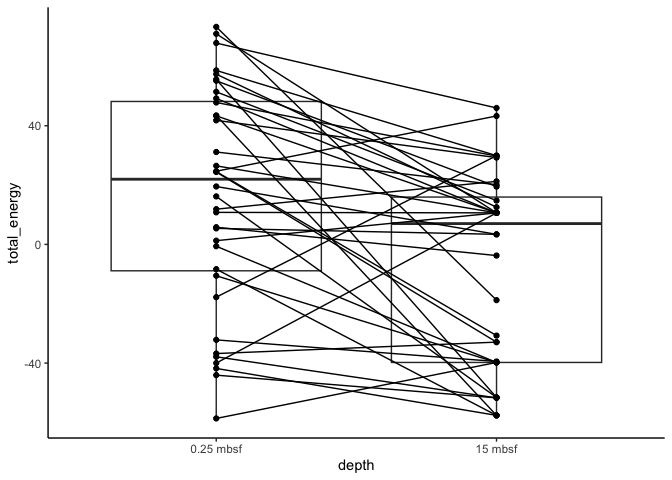

Enzyme stability plots
================

# Making “paired” free energy plots

Here’s a brief tutorial on making “paired” free energy plots, like so:


This approach uses `ggplot2`, which requires (or at least strongly
prefers) data in the “long” format. Each row should contain a single
observation (in this case, a single enzyme) and each column should
contain a variable.

However, we want to link pairs of enzymes, so those enzymes will need a
variable that is the same for each member of a pair (but different for
each set of pairs).

## Loading data from binary

I’ve stored the data as a binary `.rds` file. Note that the working
directory for this notebook is `reports/`, so we have to go up a
directory to get to `data/`.

``` r
dir()
```

    [1] "paired_dotplot_tutorial_files"     "paired_dotplot_tutorial.html"     
    [3] "paired_dotplot_tutorial.qmd"       "paired_dotplot_tutorial.rmarkdown"

``` r
library(tidyverse, verbose=FALSE)
```

    ── Attaching packages ─────────────────────────────────────── tidyverse 1.3.2 ──
    ✔ ggplot2 3.4.0      ✔ purrr   0.3.5 
    ✔ tibble  3.1.8      ✔ dplyr   1.0.10
    ✔ tidyr   1.2.1      ✔ stringr 1.4.1 
    ✔ readr   2.1.3      ✔ forcats 0.5.2 
    ── Conflicts ────────────────────────────────────────── tidyverse_conflicts() ──
    ✖ dplyr::filter() masks stats::filter()
    ✖ dplyr::lag()    masks stats::lag()

``` r
theme_set(theme_classic()) # sets a graphical theme
GH29 <- readRDS("../data/GH29_paired_homologs.rds") #
```

Let’s take a look at the structure of this data frame (or
[tibble](https://tibble.tidyverse.org/), to be precise:

``` r
glimpse(GH29)
```

    Rows: 72
    Columns: 14
    $ paired       <chr> "SRR7066492_k141_224233_4_SRR7066493_k141_1084911_2", "SR…
    $ pident       <dbl> 51.376, 51.376, 56.416, 56.416, 41.667, 41.667, 49.522, 4…
    $ length       <int> 218, 218, 413, 413, 348, 348, 418, 418, 301, 301, 460, 46…
    $ mismatch     <int> 86, 86, 180, 180, 186, 186, 198, 198, 17, 17, 206, 206, 2…
    $ gapopen      <int> 8, 8, 0, 0, 8, 8, 3, 3, 0, 0, 2, 2, 0, 0, 1, 1, 0, 0, 1, …
    $ qstart       <int> 8, 8, 14, 14, 9, 9, 4, 4, 1, 1, 5, 5, 5, 5, 1, 1, 6, 6, 6…
    $ qend         <int> 208, 208, 426, 426, 346, 346, 412, 412, 301, 301, 463, 46…
    $ sstart       <int> 13, 13, 1, 1, 15, 15, 12, 12, 1, 1, 5, 5, 3, 3, 1, 1, 7, …
    $ send         <int> 227, 227, 413, 413, 355, 355, 425, 425, 301, 301, 463, 46…
    $ evalue       <dbl> 1.92e-73, 1.92e-73, 0.00e+00, 0.00e+00, 1.75e-90, 1.75e-9…
    $ bitscore     <int> 221, 221, 515, 515, 274, 274, 427, 427, 606, 606, 536, 53…
    $ DDG          <chr> "Negative", "Negative", "Negative", "Negative", "Negative…
    $ depth        <chr> "15 mbsf", "0.25 mbsf", "15 mbsf", "0.25 mbsf", "15 mbsf"…
    $ total_energy <dbl> -39.788600, -10.548800, 3.394960, 19.526600, -30.736300, …

The relevant columns here are `total_energy`, `depth`, `DDG`, and
`paired`. This data frame is in “long” format: each row contains data
about one enzyme, and each column contains one variable describing
enzymes. `glimpse()` shows data frames sideways, so that “columns” are
horizontal. The structure is a little easier to understand with
`head()`:

``` r
head(GH29)
```

    # A tibble: 6 × 14
      paired        pident length misma…¹ gapopen qstart  qend sstart  send   evalue
      <chr>          <dbl>  <int>   <int>   <int>  <int> <int>  <int> <int>    <dbl>
    1 SRR7066492_k…   51.4    218      86       8      8   208     13   227 1.92e-73
    2 SRR7066492_k…   51.4    218      86       8      8   208     13   227 1.92e-73
    3 SRR7066492_k…   56.4    413     180       0     14   426      1   413 0       
    4 SRR7066492_k…   56.4    413     180       0     14   426      1   413 0       
    5 SRR7066492_k…   41.7    348     186       8      9   346     15   355 1.75e-90
    6 SRR7066492_k…   41.7    348     186       8      9   346     15   355 1.75e-90
    # … with 4 more variables: bitscore <int>, DDG <chr>, depth <chr>,
    #   total_energy <dbl>, and abbreviated variable name ¹​mismatch

# Building the plot piece by piece

Let’s build up this plot piece by piece;

``` r
p <- ggplot(GH29, aes(x=depth, y=total_energy)) + 
  geom_boxplot() + 
  geom_point() 
print(p)
```



This is basically what we want, but we need a way to connect pairs of
dots.

We’re using `paired` here as a common identifier for pairs of enzymes. I
think they are the accession number for the protein in the deep
sediment. The point is that each value of `paired` occurrs exactly twice
the data set. We’ll use `geom_line()` to create lines between pairs of
points, and we’ll use `group()` inside `aes()` to show *which* lines
need to be connected.

``` r
p <- p + 
  geom_line(aes(group=paired))
print(p)
```


The lines are connected! All we need to do is to color them by whether
they’re more negative in deep sediment or surface sediment.

# Writing functions for plots

It would also be a good idea to wrap this plot in a function. I know
we’re going to make a lot of these plots, so it is safer and faster to
use a single function.

``` r
ddg_plot <- function(df) {
  p <- ggplot(df, aes(x=depth, y=total_energy)) +
    geom_boxplot() + 
    geom_point(aes(colour=DDG)) + 
    # alpha = 0.5 make the lines a 50% transparent, whcih looks a little nicer
    geom_line(aes(colour = DDG, group = paired), alpha = 0.5) +
    scale_color_manual(name=NULL, values=c("#517C96", "#8D2048")) +
    # For more information on using math-like symbols in R plots,
    # type demo(plotmath)
    ylab(expression(paste("free energy of folding, kJ ", mol^{-1})))
  p
}
ddg_plot(GH29)
```


Beautiful. The colors, by the way, are “tertiary” colors of the official
UT color scheme. They’re semi-secret, but I’ll give them to you if you
ask :)

# Adding options

Finally, I probably want the option to change this plot around,
e.g. using different colors for different presentations. So, instead of
“hard-coding” the colors, axis labels, etc, let’s pass them in as
parameters, with sensible default values.

``` r
ddg_plot <- function(df, 
                     with.lines=TRUE,
                     title=NULL, 
                     colors=c("#517C96", "#8D2048"), 
                     ylab=expression(paste("free energy of folding, kJ ", mol^{-1})), 
                     legend.pos="none", 
                     theme=theme_classic(),
                     text.size=NULL) {
  p <- ggplot(df, aes(x=depth, y=total_energy)) +
    geom_boxplot() + 
    geom_point(aes(colour=DDG)) 
  
  if(with.lines) {
    p <- p + geom_point(aes(colour=DDG)) +
      geom_line(aes(x=depth, y=total_energy, colour = DDG, group = paired), alpha = 0.5) 
  }
  
  if(!is.null(title)) {
    p <- p + ggtitle(title)
  }
  if(!is.null(colors) & with.lines) {
    p <- p + scale_color_manual(name=NULL, values=colors)
  }
  if(!is.null(ylab)) {
    p <- p + scale_y_continuous(name=ylab)
  }
  if(!is.null(title)) {
    p <- p + ggtitle(title)
  }
  
  p <- p + theme
  
  if(!is.null(legend)) {
    p <- p + theme(legend.position=legend.pos)
  }
  
  if(!is.null(text.size)) {
    p <- p + theme(text = element_text(size=text.size))
  }
  p
}

p <- ddg_plot(GH29)
print(p)
```


One last important thing about saving plots in R: the `ggsave()`
function allows you to set the actual dimensions of a saved plot (in
inches, cm, pixels, or whatever). **You should always use this** when
making plots for publication, posters, or powerpoint presentations. That
way, you’ll know what the final font size is, and you can be sure that
the figures are the appropriate size for how you’re using them.

``` r
ggsave(filename="../plots/GH29_plot.png", #
       #ggsave automatically saves the file in the format consistent with the filename
       plot=p, 
       height=3, 
       width=4, 
       units="in", # because I am a cultureless American :)
       dpi=300) 
```
